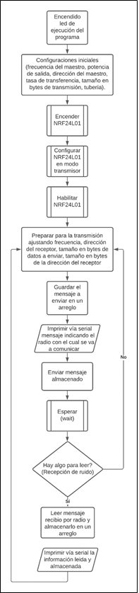
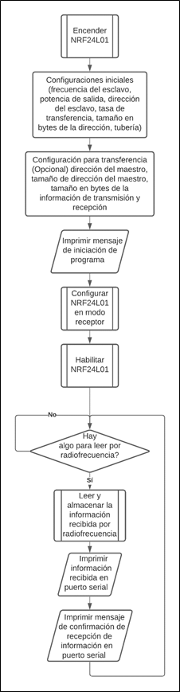

# Pruebas de comunicación Radios NRF24L01
## 1. Transmisión de Datos
Se estima que el tamaño máximo para el arreglo de información que se enviará desde el microcontrolador maestro que se comunicará con la Raspberry pi será de 4 bytes (que es el mismo tamaño de información que se configuró en los distintos radios de comunicación para cada módulo de control), por lo cual se configuró la tasa de transferencia de 250kbps y una potencia de transmisión de 0dBm para lograr el mayor alcance posible.

A continuación, se presenta el código usado para el maestro transmisor de la prueba.

 ```c
//CODIGO DE PRUEBAS PARA DIRECCIONAMIENTO
//DE RADIOS nRF24L01                                                       

#include "mbed.h"
#include "nRF24L01P.h"

#define RETARDO 2000
#define MI_FREQ 2400
#define POT  0
#define VELO 250
#define TAM_MI_D 3
#define MI_DIREC 0x000002   //DIRECCION DE RECEPCION DEL MAESTRO

#define DIR_1 0x000006      //DIRECCION DE RECEPCION EXCLAVO 1
#define TAM_R1 3
#define RF_RAD1 2425

#define DIR_2 0x00000A      //DIRECCION DE RECEPCION EXCLAVO 2
#define TAM_R2 3
#define RF_RAD2 2460

#define TAM_TX 4
#define TAMANO 4

nRF24L01P RADIO(PB_5, PB_4, PB_3, PA_15, PA_12);    // MOSI, MISO, SCK, CSN, CE, IRQ
Serial PC (PA_2,PA_3);  //TX,RX
DigitalOut ON(PC_13);

void CONF_INIC (int FRECUENCIA, int POTENCIA, int VELOCIDAD, unsigned long long DIRECCION, int ANCHO, int TUBERIA);
void ESTADO_I (void);
void PREPARAR (int ANCHO, unsigned long long DIRECCION, int TAM_DIR, int RF);
void RECIBIR (void);

char DATA_TX [TAM_TX];
char RX_DATA [TAMANO];
int  TX_CONT = 0;
int RECIBO  = 1;

int main (void)
{
    ON = 1;
    RADIO.powerUp();
    CONF_INIC (MI_FREQ, POT, VELO, MI_DIREC, TAM_MI_D, NRF24L01P_PIPE_P0);
    ESTADO_I ();
    RADIO.setTransmitMode();
    RADIO.enable();
    //RADIO.enableAutoRetransmit (1000,10);      //PRUEBA
    while (1)
    {
        PREPARAR (TAM_TX, DIR_1, TAM_R1, RF_RAD1);    //  TAMANO EN BYTES, DIRECCION, TAM_DIR, RF
        DATA_TX[0] = 'H';
        DATA_TX[1] = 'i';
        DATA_TX[2] = 'R';
        DATA_TX[3] = 'A';
        PC.printf( "\n\r***********************\n\r");
        PC.printf( "COMUNICANDO CON RADIO 1\n\r");
        PC.printf( "***********************\n\r");
        //ESTADO_I ();
        RADIO.write(NRF24L01P_PIPE_P0, DATA_TX, TAM_TX);
        TX_CONT = 0;
        RECIBO = 1;
        wait_ms (RETARDO);
 
        if(RADIO.readable())
        {
            RECIBIR();
            //wait_ms TIEMPO_MS;
        }    
    }   
}
void CONF_INIC (int FRECUENCIA, int POTENCIA, int VELOCIDAD, unsigned long long DIRECCION, int ANCHO, int TUBERIA)
{
    RADIO.setRfFrequency(FRECUENCIA);
    RADIO.setRfOutputPower(POTENCIA);
    RADIO.setAirDataRate(VELOCIDAD);
    RADIO.setRxAddress(DIRECCION, ANCHO, TUBERIA);
}
void ESTADO_I (void)
{
    PC.printf( "FRECUENCIA DE OPERACION     : %d MHz\r\n",  RADIO.getRfFrequency() );
    PC.printf( "POTENCIA DE TRANSMISION     : %d dBm\r\n",  RADIO.getRfOutputPower() );
    PC.printf( "VELOCIDAD DE TRANSMISION    : %d kbps\r\n", RADIO.getAirDataRate() );
    PC.printf( "DIRECCION DE TX             : 0x%010llX\r\n", RADIO.getTxAddress() );
    PC.printf( "DIRECCION DE RX             : 0x%010llX\r\n", RADIO.getRxAddress(0) );
}
void PREPARAR (int ANCHO, unsigned long long DIRECCION, int TAM_DIR, int RF)
{
    RADIO.setTransferSize (ANCHO);
    RADIO.setTxAddress (DIRECCION,TAM_DIR);
    RADIO.setRfFrequency (RF);
}
void RECIBIR (void)
{
    int rxDataCnt = 0;
    
    RADIO.read(NRF24L01P_PIPE_P0, RX_DATA, TAMANO);
    for(int i = 0; i<=TAMANO; i++)
    {
        PC.printf("%c",RX_DATA[i]);
    }
    PC.printf("\r\n");
}

 ```
### Diagrama de Flujo Maestro Transmisor



## 2. Recepción de Datos

El microcontrolador esclavo por su parte, todo el tiempo aguarda a la espera de la recepción de información vía RF para almacenarla e imprimir el mensaje recibido vía puerto serie junto a un mensaje de confirmación de que se ha recibido información.

```c
//CODIGO DE PRUEBAS PARA RECEPCION DE DATOS
//EN RADIOS nRF24L01                                                         

#include "mbed.h"
#include "nRF24L01P.h"

#define TIEMPO_MS       (3000)

#define FRECUENCIA_T    2425
#define POTENCIA_T      0
#define VEL_T           250
#define MI_DIRECC       0x000006
#define TAMANO_DIR      3

#define MI_FREQ 2400
#define MAESTRO 0x000002
#define TAM_MI_D 3
  
#define TAMANO          4

Serial PC(PA_2,PA_3);//TX,RX
nRF24L01P my_nrf24l01p(PB_5, PB_4, PB_3, PA_15, PA_12);    // MOSI, MISO, SCK, CSN, CE, IRQ----IRQ NO ESTA DEFINIDO NI CONECTADO, LA RECOMENDACION VIENE DADA POR LA LIBRERIA USADA

void CONF_GENER (int FRECUENCIA, int POTENCIA, int VELOCIDAD, unsigned long long DIRECCION_RX, int TAMAÑO_D, int TUBERIA);
void CONF_RADIO (unsigned long long DIRECCION_TX, int TAM_INFO);
void RECIBIR (void);

char RX_DATA [TAMANO];
char DATA_TX [TAMANO];
int  TX_CONT = 0;

int main ()
{
    my_nrf24l01p.powerUp();                                                                             //Radio ENCENDIDO y en modo STANDBY
    CONF_GENER (FRECUENCIA_T, POTENCIA_T, VEL_T, MI_DIRECC, TAMANO_DIR, NRF24L01P_PIPE_P0);                     //CONFIGURACION INICIAL radio
    CONF_RADIO (MAESTRO, TAMANO); 
    PC.printf("********************CONF_INICIAL********************\r\n");                              //DIRECCION INICIAL de Transmision
    PC.printf("****************************************************\r\n");                                                                                           //Imprimir en el terminal CONFIGURACION INICIAL del RADIO
    my_nrf24l01p.setReceiveMode(); //Modo de RECEPCION ACTIVADO
    my_nrf24l01p.enable();
    
    while (1)
    { 
        if(my_nrf24l01p.readable())
        {
            RECIBIR();
            PC.printf("RADIO 1 RECIBIO DATOS\r\n");
        }
    }   
}

void CONF_GENER (int FRECUENCIA, int POTENCIA, int VELOCIDAD, unsigned long long DIRECCION_RX, int TAMAÑO_D, int TUBERIA)
{
    my_nrf24l01p.setRfFrequency(FRECUENCIA);                        //FRECUENCIA de TRANSMISION en MHz  (2400-2525)
    my_nrf24l01p.setRfOutputPower(POTENCIA);                        //POTENCIA DE SALIDA EN dBm
    my_nrf24l01p.setAirDataRate(VELOCIDAD);                         //Velocidad de TRASNFERENCIA de Datos en KBTS/S
    my_nrf24l01p.setRxAddress(DIRECCION_RX, TAMAÑO_D, TUBERIA);     //Configuracion de DIRECCION de RECEPCION (DIRECCION, TAMAÑO de la DIRECCION en bytes, TUBERIA 0-5) LAS TUBERIAS 0 Y 1 admiten tamaños de 3,4,5 bytes. Las Demas por defecto solo tienen un byte de tamaño para la direccion
}
void CONF_RADIO (unsigned long long DIRECCION_TX, int TAM_INFO)
{
    my_nrf24l01p.setTxAddress(DIRECCION_TX, TAMANO_DIR);              //Configuracion de DIRECCION de TRANSMISION (DIRECCION, TAMAÑO de la DIRECCION en bytes) LA TUBERIA va directamente LIGADA a la configurada en la RECEPCION
    my_nrf24l01p.setTransferSize(TAM_INFO);                           //ESTABLECER el TAMAÑO en BYTES de la TRANSFERENCIA 
}    
void RECIBIR (void)
{
    int rxDataCnt = 0;
    
    my_nrf24l01p.read(NRF24L01P_PIPE_P0, RX_DATA, TAMANO);
    for(int i = 0; i<=TAMANO; i++)
    {
        PC.printf("%c",RX_DATA[i]);
    }
    PC.printf("\r\n");
}

```
### Diagrama de Flujo Esclavo Receptor



