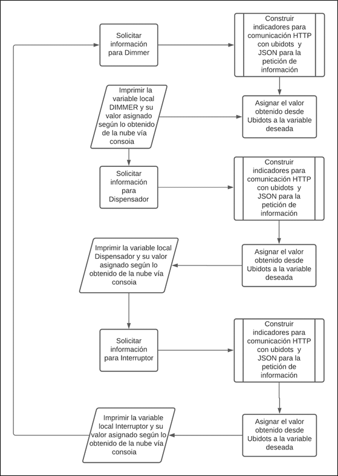
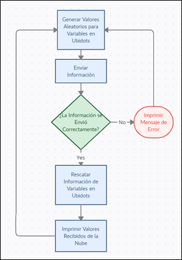

# Pruebas de Enlace Entre Ubidots y Raspberry Pi

Ubidots provee un tutorial para la descarga de la librería REQUEST  para la comunicación HTTP, clase necesaria para la comunicación con páginas web. Adicionalmente proporciona un código ejemplo en Python que permite generar valores aleatorios para posteriormente modificarlos en la plataforma, y otro código para salvar datos alojados en la nube y llevarlos a nuestro programa Python. En este caso se utilizaron ambos códigos de ejemplo y se realizaron ligeros cambios en los mismos para que las funciones propuestas en el tutorial permitan la modificación y la lectura de una variable a la vez, esto con el fin de tener un mayor control del flujo del programa y optimizar en algunos casos el envío de información.

## 1. ENVÍO DE INFORMACIÓN:
Este código es utilizado para enlazar la plataforma Ubidots con el dispositivo usado (Raspberry pi) para esto es necesario usar el Token y dispositivo específico que se puede visualizar en la cuenta de usuario en Ubidots. De igual manera, se relacionan variables en la nube con variables locales del Python. 

Posteriormente genera una serie de valores aleatorios para cada variable contemplada, crea un diccionario donde enlaza la variable con el valor asignado y finalmente el envío de información se realiza generando un JSON que será lo que la plataforma interpretará y modificará de acuerdo a nuestro propósito.

A continuación, se presenta el código usado para el maestro transmisor de la prueba.

### CODIGO EJEMPLO PARA MODIFICAR DATOS EN LA NUBE

 ```python
import time
import requests
import math
import random

TOKEN = "BBFF-1JPdBOfYF2swcxLWhBIwkKDZLmeBti"  # Put your TOKEN here
DEVICE_LABEL = "raspberry"  # Put your device label here 
VARIABLE_LABEL_1 = "temperature"  # Put your first variable label here
VARIABLE_LABEL_2 = "humidity"  # Put your second variable label here
VARIABLE_LABEL_3 = "position"  # Put your second variable label here


def build_payload(variable_1, variable_2, variable_3):
    # Creates two random values for sending data
    value_1 = random.randint(-10, 50)
    value_2 = random.randint(0, 85)

    # Creates a random gps coordinates
    lat = random.randrange(34, 36, 1) + \
        random.randrange(1, 1000, 1) / 1000.0
    lng = random.randrange(-83, -87, -1) + \
        random.randrange(1, 1000, 1) / 1000.0
    payload = {variable_1: value_1,
               variable_2: value_2,
               variable_3: {"value": 1, "context": {"lat": lat, "lng": lng}}}

    return payload


def post_request(payload):
    # Creates the headers for the HTTP requests
    url = "http://industrial.api.ubidots.com"
    url = "{}/api/v1.6/devices/{}".format(url, DEVICE_LABEL)
    headers = {"X-Auth-Token": TOKEN, "Content-Type": "application/json"}

    # Makes the HTTP requests
    status = 400
    attempts = 0
    while status >= 400 and attempts <= 5:
        req = requests.post(url=url, headers=headers, json=payload)
        status = req.status_code
        attempts += 1
        time.sleep(1)

    # Processes results
    print(req.status_code, req.json())
    if status >= 400:
        print("[ERROR] Could not send data after 5 attempts, please check \
            your token credentials and internet connection")
        return False

    print("[INFO] request made properly, your device is updated")
    return True


def main():
    payload = build_payload(
        VARIABLE_LABEL_1, VARIABLE_LABEL_2, VARIABLE_LABEL_3)

    print("[INFO] Attemping to send data")
    post_request(payload)
    print("[INFO] finished")


if __name__ == '__main__':
    while (True):
        main()
        time.sleep(1)

 ```
### Diagrama de Flujo Envío de Información a Ubidots


## 2. RESCATE DE INFORMACIÓN DESDE LA NUBE

El código proporcionado por Ubidots para rescatar valores desde la nube es presentado a continuación, el mismo realiza el mismo proceso de construcción de ficheros para la comunicación HTTP. La diferencia radica en que realiza la solicitud del valor de una variable y este es devuelto en un JSON que de igual forma es interpretado y retornado como un valor flotante (según el tipo de dato almacenado en Ubidots).

### CODIGO EJEMPLO PARA RESCATAR DATOS DESDE LA NUBE

```python
import requests
import random
import time

TOKEN = "BBFF-1JPdBOfYF2swcxLWhBIwkKDZLmeBti" # Assign your Ubidots Token
DEVICE = "raspberry" # Assign the device label to obtain the variable
VARIABLE_0 = "dimmer" # Assign the variable label to obtain the variable value
VARIABLE_1 = "interruptor" # Assign the variable label to obtain the variable value
VARIABLE_2 = "dispensador" # Assign the variable label to obtain the variable value
DELAY = 1  # Delay in seconds

def get_var(device, variable):
    try:
        url = "http://industrial.api.ubidots.com/"
        url = url + \
            "api/v1.6/devices/{0}/{1}/".format(device, variable)
        headers = {"X-Auth-Token": TOKEN, "Content-Type": "application/json"}
        req = requests.get(url=url, headers=headers)
        return req.json()['last_value']['value']
    except:
        pass


if __name__ == "__main__":
    while True:
        DIMMER = get_var(DEVICE, VARIABLE_0)
        print("VALOR DE DIMER:     " + str(DIMMER) + "   " + str(type(DIMMER)))
        
         = get_var(DEVICE, VARIABLE_1)
        print("ESTADO INTERRUPTOR: " + str(INTERRUPTOR) + "   " + str(type(INTERRUPTOR)))
        
        DISPENSADOR = get_var(DEVICE, VARIABLE_2)
        print("ESTADO DISPENSADOR: " + str(DISPENSADOR) + "   " + str(type(DISPENSADOR)))
        time.sleep(DELAY)

```
### Diagrama de Flujo Rescate de Información desde Ubidots



## 3. CÓDIGO UNIFICADO
Finalmente, las pruebas realizadas consistieron en unificar los códigos proporcionados por la plataforma modificándolos para el envío y rescate de información 1 dato a la vez, esto con el fin de optimizar el tiempo de envío de información, facilitar la interpretación del algoritmo, y tener un mayor control sobre los procesos que este mismo realiza.

### CODIGO UNIFICADO PARA ENVÍO Y RESCATE DE INFORMACIÓN DESDE LA NUBE

```python
import requests
import random
import time
import math

TOKEN = "BBFF-1JPdBOfYF2swcxLWhBIwkKDZLmeBti"  # Put your TOKEN here
DEVICE_LABEL = "raspberry"  # Put your device label here

CICLO_UTIL = "dimmer"  # Assign the variable label to obtain the variable value
INTERRUPTOR = "interruptor"  # Assign the variable label to obtain the variable value

COMIDA = "dispensador_com"  # Assign the variable label to obtain the variable value
AGUA = "dispensador_agua"  # Assign the variable label to obtain the variable value

CORRIENTE = "sen_cor"  # Assign the variable label to obtain the variable value
TOMA_CORREINTE = "toma_cor"  # Assign the variable label to obtain the variable value

DELAY = 1  # Delay in seconds


def CONSTRUIR_DATO(VARIABLE, VALOR):
    payload = {VARIABLE: VALOR}
    return payload


def ENVIAR_DATO(payload):
    # Creates the headers for the HTTP requests
    url = "http://industrial.api.ubidots.com"
    url = "{}/api/v1.6/devices/{}".format(url, DEVICE_LABEL)
    headers = {"X-Auth-Token": TOKEN, "Content-Type": "application/json"}

    # Makes the HTTP requests
    status = 400
    attempts = 0
    while status >= 400 and attempts <= 5:
        req = requests.post(url=url, headers=headers, json=payload)
        status = req.status_code
        attempts += 1
        time.sleep(1)

    # Processes results
    print(req.status_code, req.json())
    if status >= 400:
        print("[ERROR] No se pudo enviar informaci�n despues de realizar 5 intentos")
        return False

    print("[INFO] Variable actualizada")
    return True


def OBTENER_DATO(device, variable):
    try:
        url = "http://industrial.api.ubidots.com/"
        url = url + \
              "api/v1.6/devices/{0}/{1}/".format(device, variable)
        headers = {"X-Auth-Token": TOKEN, "Content-Type": "application/json"}
        req = requests.get(url=url, headers=headers)
        return req.json()['last_value']['value']
    except:
        pass


if _name_ == '_main_':
    while (True):

        for i in range(0, 101, 10):
            payload = CONSTRUIR_DATO(CICLO_UTIL, i)
            ENVIAR_DATO(payload)

        DIMMER = int(OBTENER_DATO(DEVICE_LABEL, CICLO_UTIL))
        print("VALOR DE DIMER:     " + str(DIMMER) + "   " + str(type(DIMMER)))

        INTERRUP = int(OBTENER_DATO(DEVICE_LABEL, INTERRUPTOR))
        print("ESTADO INTERRUPTOR: " + str(INTERRUP) + "   " + str(type(INTERRUP)))

        DISPENSADOR = int(OBTENER_DATO(DEVICE_LABEL, COMIDA))
        print("ESTADO DISPENSADOR: " + str(DISPENSADOR) + "   " + str(type(DISPENSADOR)))

```
### Diagrama de Flujo Rescate y Envío de Información a Ubidots


