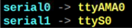

# Procedimiento para Habilitar Puerto Serie Raspberry Pi Para Uso en Archivos .py
## 1. Habilitar puerto TTL:
Se debe garantizar que los periféricos de la Raspberry estén configurados de la siguiente manera:  
 


## 2. Verificar cómo está configurado el puerto serie de la Raspberry:
Ejecutar el siguiente comando mediante consola:

```linux
ls -l /dev  
```

Se debe visualizar una configuración de los puertos Serie tal como la siguiente:


 

## 3. Modificar el archivo de configuración de arranque:
Para abrir el archivo de arranque, se ejecuta el siguiente comando vía consola:

```linux
sudo nano /boot/config.txt  
```

En la última línea de código habilitar el módulo UART agregando la siguiente línea de código: 

```
enable_uart = 1  
```
A continuación, se debe salvar las modificaciones en el archivo y cerrar el editor  

## 4. Deshabilitar la interfaz con la consola vía puerto serie:

Ejecutar los siguientes comandos vía consola
:

```linux
sudo systemctl stop serial-getty@ttyS0.service  
```
```linux
sudo systemctl disable serial-getty@ttyS0.service  
```
## 5. Intercambiar los puertos seriales (definir puerto AMA0 como principal con las ventajas que ello confiere):
Se debe abrir el archivo de configuración del arranque:  

```linux
sudo nano /boot/config.txt  
```

Y en la última línea de código agregar el siguiente comando: 

```linux
dtoverlay=pi3-miniuart-bt  
```
A continuación, se debe salvar las modificaciones en el archivo y cerrar el editor. Para que el sistema tome los cambios, se debe reiniciar la Raspberry.  

## 6. Ejecutar nuevamente el comando mencionado en el paso 1
```linux
ls -l /dev  
```

Se debe visualizar la siguiente asignación de puertos vía consola:


 
 En este momento ya es funcional el puerto serial en la Raspberry Pi para ser usado por programas Python (.py)

 
 
