# Diseño Módulo Dimmer
### Tarjeta de circuito impreso módulo Dimmer
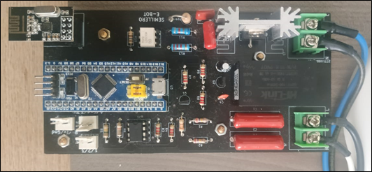

Para controlar el ángulo de disparo para cada semiciclo de la señal sinusoidal de la red doméstica (120V-60Hz para Colombia), es necesario identificar el instante de tiempo en el cual la señal tiene un valor de 0V, pues este punto será la referencia que tendremos para realizar los cálculos necesarios y realizar la activación de la etapa de potencia en el momento justo según la orden enviada desde Ubidots.
### Carga al 30%
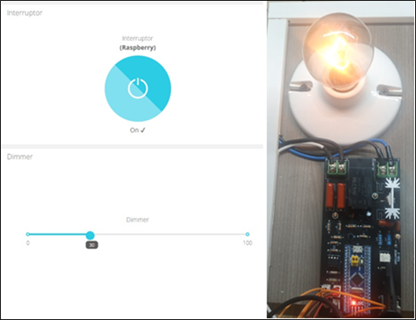
### Carga al 100%

### Circuito detector de cruce por cero
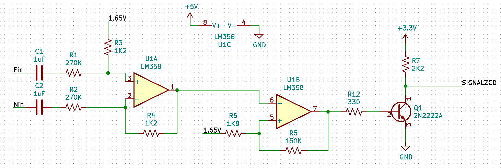

El circuito detector de cruce por cero desarrollado está encargado de generar una señal cuadrada a la salida (SIGNALZCD), donde los flancos de subida y de baja coinciden con el punto exacto donde la señal de la red doméstica toma un valor de 0V.

En la entrada (Fin-Nin) es conectada la señal alterna de la red, esta pasa por una etapa de atenuación (R1-R3), además cuenta con dos capacitores (C1-C2) que proporcionan aislamiento galvánico. La señal atenuada ingresa a un amplificador diferencial cuya función es rechazar las señales en modo común provenientes de la red eléctrica y evitar que pasen al sistema; para que la señal en su salida esté montada sobre un nivel DC, la resistencia R3 se conecta a la referencia de 1.65V. Para que el sistema no tenga ganancia R1 es igual a R2, y R3 es igual a R4.

### Señal de salida amplificador diferencial


La señal filtrada y sumada con un nivel DC es llevada a un amplificador operacional configurado como comparador con histéresis. El voltaje de referencia o comparación será el mismo voltaje de Offset adicionado a la señal en la etapa anterior, pues este nivel DC coincide con los instantes de tiempo donde la señal alterna cruza por cero. 
### Curva característica circuito detector de cruce por cero
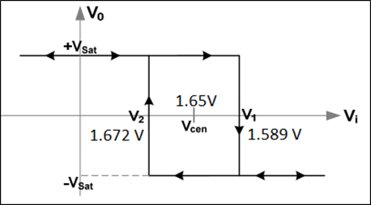
### Señal de salida circuito detector de cruce por cero


La salida del comparador no puede ser conectada directamente al microcontrolador, pues el voltaje de alimentación del TL084 es de 5V DC y su voltaje de saturación supera los 3.3V que es el umbral máximo de las entradas de la Blue Pill. Esto nos lleva a conectar un transistor a la salida del comparador, con el fin de obtener la señal de salida (señal cuadrada de cruce por cero - SIGNALZCD) con valores de 3.3V para un valor ALTO y así evitar daños en el microcontrolador.

Una vez tratada la señal de la red doméstica para detectar el cruce por cero, el control de ángulo de disparo es determinado por el microcontrolador según el porcentaje definido por el usuario desde Ubidots, pues dicho porcentaje será el entregado a la carga tanto en el semiciclo positivo, como en el negativo.
### Diagrama esquemático etapa de control
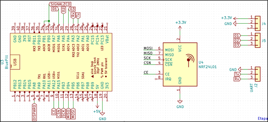

En la figura se observa que se adicionaron 2 conectores a los cuales irán conectados 3 botones capacitivos los cuales permiten variar el ciclo útil de la señal de disparo manualmente (aumentar o disminuir) o apagar directamente la carga. 
### Señal de disparo carga al 30%
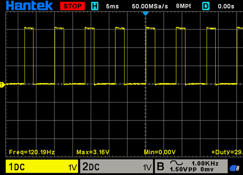
### Señal de disparo carga al 100%
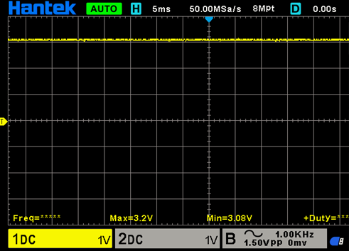

## Bloque de código para los calculos de tiempo en alto y bajo de la señal digital de disparo

```c
if (CICLO_R == 1)
{   
    PC.printf("ENTRO A HACER CALCULOS \r\n");
    CICLO_R = 0;
    CENTENAS = (CU_DATA [0] - 48) * 100;
    DECENAS = (CU_DATA [1] - 48) * 10;
    UNIDADES = (CU_DATA [2] - 48);
    PORCENTAJE = CENTENAS + DECENAS + UNIDADES;
    PC.printf("%d %d %d %d \r\n",CENTENAS,DECENAS,UNIDADES, PORCENTAJE);
    if(PORCENTAJE >= 0 && PORCENTAJE <= 100)
    {
        T_ALTO = 83.33 * PORCENTAJE;
        T_BAJO = 8333-T_ALTO;
        PC.printf("EL PORCENTAJE ESTA ENTRE 0 Y 100**** TIEMPO EN ALTO: %d \r\n",T_ALTO);
    }    
}
```

Primero, se descompone el vector de información recibida por RF desde el maestro para identificar el valor porcentual definido por el usuario. Posteriormente, dicho valor porcentual se multiplica por 83.33 (que es el tiempo de cada semiciclo) y es almacenado en una variable denominada T_ALTO, pues si el porcentaje fuera igual a 100, el tiempo en alto (tiempo que debe estar activo el TRIAC) de la señal debería ser de 8333uS. En otras palabras, el tiempo en alto de la señal corresponde a un valor porcentual definido por el usuario, y el tiempo en bajo (el TRIAC se encuentra apagado) será igual al tiempo de oscilación menos el tiempo en alto calculado. Lo anterior aplica tanto para el semiciclo positivo como para el semiciclo negativo

Es importante resaltar que desde Ubidots se cuenta con 101 pasos para la selección del porcentaje de potencia entregada a la carga (valores de 0 a 100), mientras que la configuración del ciclo útil mediante los botones capacitivos permite únicamente 11 pasos (cada paso aumenta o disminuye en 10% la potencia entregada a la carga).


## Bloque de Código para Evitar Desbordes en los Valores del Ciclo Útil
```c
void FLANCOS (void)
{
    if(PORCENTAJE == 0)
    {
        DISPARO = 0;
    }
    else if(PORCENTAJE == 100)
    {
        DISPARO = 1;
    }
    else 
    {
        DISPARO = 0;
        TM_OUT.attach_us(&DESACTIVAR,T_BAJO);
    }    
}
```

Posteriormente, el microcontrolador detecta cada flanco (tanto subida como bajada) de la señal de cruce por cero mediante una interrupción. Si el porcentaje de luminosidad determinado por el usuario es igual a 0, entonces se asegura que la señal de disparo del TRIAC se mantenga siempre en bajo, mientras que cuando dicho valor es igual a 100, se asegura que la etapa de potencia esté activa todo el tiempo. Cuando el valor del dimmer proporcionado por el usuario es diferente a 0 y 100, entonces, el microcontrolador asegura un valor lógico de 0 en la señal de disparo, y sólo activará la etapa de potencia una vez pasado el tiempo en bajo (T_BAJO) calculado. 
### Funcionamiento Dimmer controaldo desde Ubidots
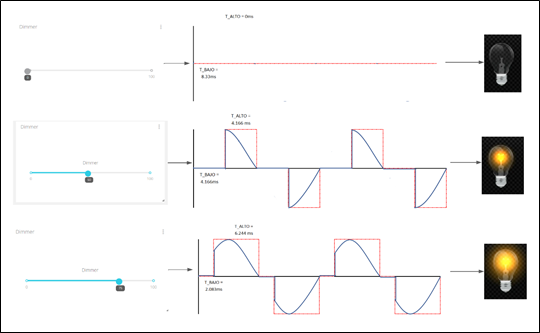

Como resultado, la señal de DISPARO es una señal cuadrada, de 120 Hz, alineada a la derecha, y cuyo ciclo útil es proporcional al valor definido en el dashboard por el usuario.

La etapa de potencia está compuesta por un optoacoplador con salida de TRIAC sin circuito de detección de cruce por cero (para un control arbitrario del TRIAC) junto a un BT138 capaz de soportar cargas de máximo 12A. Al TRIAC se le adicionó una red Snubber para evitar falsos disparos en gate y se provee la inclusión de otra red Snubber para cargas inductivas (R14 - C6).
### Señal de disparo y señal en la carga al 30%
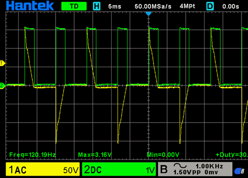
### Señal de disparo y señal en la carga al 50%
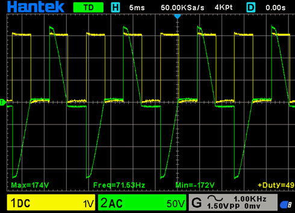
### Diagrama esquemático etapa de potencia
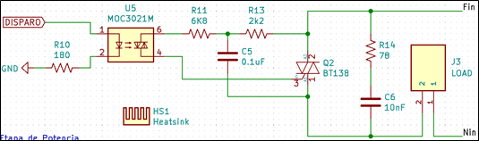
### Diagrama esquemático etapa de alimentación y referencia de voltaje
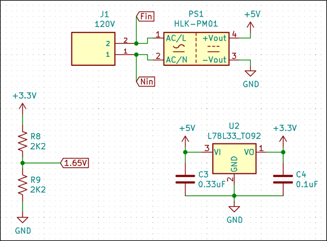


## Código Completo Módulo Dimmer

```c
//CODIGO ESCLAVO CONTROL DE LUZ Y DIMMER
//EN RADIOS nRF24L01                                                         

#include "mbed.h"
#include "nRF24L01P.h"

#define RETARDO       2000
#define REPETIR_ENVIO 20

#define MI_FREQ_MST 2400
#define DIR_MAESTRO 0x000002   //DIRECCION DE RECEPCION DEL MAESTRO


#define RF_DIMMER 2460
#define DIR_DIMMER 0x00000C
#define POTENCIA_T      0
#define VEL_T           250
#define TAMANO_DIR      3
  
#define TAMANO          4

Serial PC(PA_2,PA_3);//TX,RX

nRF24L01P RADIO(PB_5, PB_4, PB_3, PA_15, PA_12);    // MOSI, MISO, SCK, CSN, CE, IRQ----IRQ NO ESTA DEFINIDO NI CONECTADO, LA RECOMENDACION VIENE DADA POR LA LIBRERIA USADA

InterruptIn F_SUBIDA(PB_0);
InterruptIn F_BAJADA(PB_1);
InterruptIn F_SUBIR(PA_4);
InterruptIn F_BAJAR(PA_5);
InterruptIn F_APAGAR(PA_6);
DigitalOut DISPARO(PA_8);
Timeout TM_OUT;
Timer timer;

void CONF_GENER (int FRECUENCIA, int POTENCIA, int VELOCIDAD, unsigned long long DIRECCION_RX, int TAMAÑO_D, int TUBERIA);
void CONF_RADIO (unsigned long long DIRECCION_TX, int TAM_INFO);
void RECIBIR (void);
void PREPARAR (int ANCHO, unsigned long long DIRECCION, int TAM_DIR, int RF);
void FLANCOS (void);
void DESACTIVAR (void);
void ENVIARC (void);

void AUMENTAR (void);
void DISMINUIR (void);
void OFF_DIMM (void);

int INTENTOS = 0;

char RX_DATA [TAMANO];
char TX_DATA [TAMANO];
char CU_DATA [TAMANO];
char CONFIRMAR [TAMANO] = {'U','U','U','U'};
char CONFIRMAR_2 [TAMANO] = {'O','O','U','U'};
char CICLO_R = 0;

int CENTENAS = 0;
int DECENAS = 0;
int UNIDADES = 0;
int PORCENTAJE = 0;
unsigned int T_ALTO = 0;
unsigned int T_BAJO = 0;

char LETRA = 0;
int TEMP;

float TIEMPO = 0;

int main ()
{
    DISPARO = 0;
    RADIO.powerUp();                                                                             //Radio ENCENDIDO y en modo STANDBY
    CONF_GENER (RF_DIMMER, POTENCIA_T, VEL_T, DIR_DIMMER, TAMANO_DIR, NRF24L01P_PIPE_P0);                     //CONFIGURACION INICIAL radio
    CONF_RADIO (DIR_MAESTRO, TAMANO); 
    PC.printf("********************CONF_INICIAL********************\r\n");                              //DIRECCION INICIAL de Transmision
    PC.printf( "nRF24L01+ Frequency    : %d MHz\r\n",  RADIO.getRfFrequency() );
    PC.printf( "nRF24L01+ Output power : %d dBm\r\n",  RADIO.getRfOutputPower() );
    PC.printf( "nRF24L01+ Data Rate    : %d kbps\r\n", RADIO.getAirDataRate() );
    PC.printf( "nRF24L01+ TX Address   : 0x%010llX\r\n", RADIO.getTxAddress() );
    PC.printf( "nRF24L01+ RX Address   : 0x%010llX\r\n", RADIO.getRxAddress() );
    PC.printf("****************************************************\r\n");
    RADIO.setReceiveMode(); //Modo de RECEPCION ACTIVADO
    RADIO.enable();
    
    F_BAJADA.fall(&FLANCOS);
    F_SUBIDA.rise(&FLANCOS);
    F_SUBIR.rise(&AUMENTAR);
    F_BAJAR.rise(&DISMINUIR);
    F_APAGAR.rise(&OFF_DIMM);

    ENVIARC();
    
    while (1)
    {
        if(RADIO.readable())
        {
            PC.printf("ALGO LLEGO\r\n");
            RECIBIR();     
            if((RX_DATA [3] == 'C') /* (PORCENTAJE >= 0 && PORCENTAJE <= 100)*/)
            {
                CICLO_R = 1;
                RADIO.setTransmitMode();
                char RESPUESTA = 0;
                while(RESPUESTA == 0)
                
                {
                    PREPARAR (TAMANO, DIR_MAESTRO, TAMANO_DIR, MI_FREQ_MST);
                    wait_ms(250);
                    RADIO.write(NRF24L01P_PIPE_P0, CONFIRMAR, TAMANO);
                    RESPUESTA = RESPUESTA + 1;
                    for(int i = 0; i<TAMANO; i++)
                    {
                        PC.printf("%c",CONFIRMAR[i]);
                    }
                    PC.printf("\r\n");
                    //wait_ms (RETARDO);
                }
                RESPUESTA = 0;
                RADIO.setRfFrequency(RF_DIMMER);
                RADIO.setReceiveMode();
            }
            if(RX_DATA [0] == 'L' && RX_DATA [1] == 'G' && RX_DATA [2] == 'O' && RX_DATA [3] == 'F')
            {
                CICLO_R = 1;
                CU_DATA [0] = CU_DATA [1] = CU_DATA [2] = '0';
                RADIO.setTransmitMode();
                char RESPUESTA = 0;
                while(RESPUESTA == 0)
                {
                    PREPARAR (TAMANO, DIR_MAESTRO, TAMANO_DIR, MI_FREQ_MST);
                    wait_ms(250);
                    RADIO.write(NRF24L01P_PIPE_P0, CONFIRMAR_2, TAMANO);
                    RESPUESTA = RESPUESTA + 1;
                    for(int i = 0; i<TAMANO; i++)
                    {
                        PC.printf("%c",CONFIRMAR_2 [i]);
                    }
                    PC.printf("\r\n");
                    //wait_ms (RETARDO);
                }
                RESPUESTA = 0;
                RADIO.setRfFrequency(RF_DIMMER);
                RADIO.setReceiveMode();
            }
            for (int i = 0; i<4;i++)
            {
                RX_DATA[i] = ' ';
            }           
        }
        if (CICLO_R == 1)
        {   
            PC.printf("ENTRO A HACER CALCULOS \r\n");
            CICLO_R = 0;
            CENTENAS = (CU_DATA [0] - 48) * 100;
            DECENAS = (CU_DATA [1] - 48) * 10;
            UNIDADES = (CU_DATA [2] - 48);
            PORCENTAJE = CENTENAS + DECENAS + UNIDADES;
            PC.printf("%d %d %d %d \r\n",CENTENAS,DECENAS,UNIDADES, PORCENTAJE);
            if(PORCENTAJE >= 0 && PORCENTAJE <= 100)
            {
                T_ALTO = 83.33 * PORCENTAJE;
                T_BAJO = 8333-T_ALTO;
                PC.printf("EL PORCENTAJE ESTA ENTRE 0 Y 100**** TIEMPO EN ALTO: %d \r\n",T_ALTO);
            }    
        }
        
        
        TIEMPO = timer.read();
        if(TIEMPO >= 5.0)
        {
            timer.stop();
            timer.reset();
            ENVIARC();
        }
    }   
}

void CONF_GENER (int FRECUENCIA, int POTENCIA, int VELOCIDAD, unsigned long long DIRECCION_RX, int TAMAÑO_D, int TUBERIA)
{
    RADIO.setRfFrequency(FRECUENCIA);                        //FRECUENCIA de TRANSMISION en MHz  (2400-2525)
    RADIO.setRfOutputPower(POTENCIA);                        //POTENCIA DE SALIDA EN dBm
    RADIO.setAirDataRate(VELOCIDAD);                         //Velocidad de TRASNFERENCIA de Datos en KBTS/S
    RADIO.setRxAddress(DIRECCION_RX, TAMAÑO_D, TUBERIA);     //Configuracion de DIRECCION de RECEPCION (DIRECCION, TAMAÑO de la DIRECCION en bytes, TUBERIA 0-5) LAS TUBERIAS 0 Y 1 admiten tamaños de 3,4,5 bytes. Las Demas por defecto solo tienen un byte de tamaño para la direccion
}
void CONF_RADIO (unsigned long long DIRECCION_TX, int TAM_INFO)
{
    RADIO.setTxAddress(DIRECCION_TX, TAMANO_DIR);              //Configuracion de DIRECCION de TRANSMISION (DIRECCION, TAMAÑO de la DIRECCION en bytes) LA TUBERIA va directamente LIGADA a la configurada en la RECEPCION
    RADIO.setTransferSize(TAM_INFO);                           //ESTABLECER el TAMAÑO en BYTES de la TRANSFERENCIA 
}    
void RECIBIR (void)
{
    int rxDataCnt = 0;
    
    RADIO.read(NRF24L01P_PIPE_P0, RX_DATA, TAMANO);
    for(int i = 0; i<=TAMANO; i++)
    {
        PC.printf("%c",RX_DATA[i]);
        CU_DATA [i] = RX_DATA[i];
    }
    PC.printf("\r\n");
}
void PREPARAR (int ANCHO, unsigned long long DIRECCION, int TAM_DIR, int RF)
{
    RADIO.setTransferSize (ANCHO);
    RADIO.setTxAddress (DIRECCION,TAM_DIR);
    RADIO.setRfFrequency (RF);
}
void FLANCOS (void)
{
    if(PORCENTAJE == 0)
    {
        DISPARO = 0;
    }
    else if(PORCENTAJE == 100)
    {
        DISPARO = 1;
    }
    else 
    {
        DISPARO = 0;
        TM_OUT.attach_us(&DESACTIVAR,T_BAJO);
    }    
}
void DESACTIVAR (void)
{
     DISPARO = 1;
}
void ENVIARC (void)
{
    TX_DATA [0] = ((CENTENAS / 100) + 48);
    TX_DATA [1] = ((DECENAS / 10) + 48);
    TX_DATA [2] = UNIDADES + 48;
    TX_DATA [3] = 'C';
    //
    char RESP = 0;     //UBICAR 
    while(RESP == 0)
    {
        RADIO.setTransmitMode();
        RADIO.setRfFrequency(MI_FREQ_MST);
        RADIO.write(NRF24L01P_PIPE_P0, TX_DATA, TAMANO);
        PC.printf("RADIO ENVIO MENSAJE \r\n");
        RADIO.setRfFrequency (RF_DIMMER);
        RADIO.setReceiveMode();
        wait_ms (RETARDO);
        if(RADIO.readable())
        {
            PC.printf("RADIO TIENE ALGO PARA LEER \r\n");
            RECIBIR();
            if(RX_DATA[0] == 'C' && RX_DATA[1] == 'U' && RX_DATA[2] == 'R' && RX_DATA[3] == 'R')
            {
                RESP = 1;
                RADIO.setRfFrequency (RF_DIMMER);
                RADIO.setReceiveMode();
            }
        }
        
        INTENTOS = INTENTOS + 1;
        
        if (INTENTOS >= REPETIR_ENVIO)
        {
            RESP = 1;
            RADIO.setRfFrequency (RF_DIMMER);
            RADIO.setReceiveMode();
            INTENTOS = 0;
        }
    }
}
void AUMENTAR (void)
{
    CICLO_R = 1;
    PORCENTAJE = PORCENTAJE + 10;
    if(PORCENTAJE < 0)
    {
        PORCENTAJE = 0;
        CU_DATA [0] = CU_DATA [1] = CU_DATA [2] = '0';
        timer.stop();
        timer.reset();
        timer.start();
    }
    else if(PORCENTAJE > 100)
    {
        PORCENTAJE = 100;
        CU_DATA [0] = '1';
        CU_DATA [1] = CU_DATA [2] = '0';
        timer.stop();
        timer.reset();
        timer.start();
    }
    else
    {
        CU_DATA [0] = (PORCENTAJE / 100) + 48;
        TEMP = PORCENTAJE % 100;
        CU_DATA [1] = (TEMP / 10) + 48;
        CU_DATA [2] = (TEMP % 10) + 48;
        timer.stop();
        timer.reset();
        timer.start();
    }
}
void DISMINUIR (void)
{
    CICLO_R = 1;
    PORCENTAJE = PORCENTAJE - 10;
    if(PORCENTAJE < 0)
    {
        PORCENTAJE = 0;
        CU_DATA [0] = CU_DATA [1] = CU_DATA [2] = '0';
        timer.stop();
        timer.reset();
        timer.start();
    }
    else if(PORCENTAJE > 100)
    {
        PORCENTAJE = 100;
        CU_DATA [0] = '1';
        CU_DATA [1] = CU_DATA [2] = '0';
        timer.stop();
        timer.reset();
        timer.start();
    }
    else
    {
        CU_DATA [0] = (PORCENTAJE / 100) + 48;
        TEMP = PORCENTAJE % 100;
        CU_DATA [1] = (TEMP / 10) + 48;
        CU_DATA [2] = (TEMP % 10) + 48;
        timer.stop();
        timer.reset();
        timer.start();
    }
}
void OFF_DIMM (void)
{
    if(PORCENTAJE != 0)
    {
        CICLO_R = 1;
        CU_DATA [0] = CU_DATA [1] = CU_DATA [2] = '0';
        timer.stop();
        timer.reset();
        timer.start();
    }
}
```
## Diagrama de Flujo Módulo Dimmer
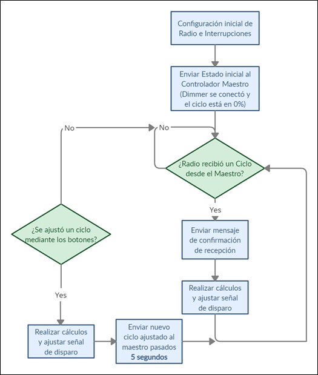