# __Diseño Módulo de Monitoreo de Puerta__
### Tarjeta de circuito impreso módulo de monitoreo de puerta


El sistema de monitoreo está encargado de detectar la apertura de la puerta mediante un interruptor magnético normalmente cerrado y enviar una alerta al controlador maestro para que la SBC se encargue de tomar un breve video (10 segundos) desde la cámara IP para posteriormente enviarlo al correo electrónico del usuario. Para realizar la comunicación entre la Raspberry Pi y la cámara IP, y además capturar el video, es necesario instalar una serie de librerías descritas a continuación: 

* __OPENCV:__ Encargada de forzar la grabación y procesar el video proporcionada por la cámara IP.
* __PICKLE:__ Encargada de extraer y almacenar el token de "client_secret.json" para la autenticación con la API de Gmail. 
* __CLIENTE DE GOOGLE:__ Biblioteca del cliente de google encargada de enviar correos electronicos mediante la API de google.

A continuación, se describe los pasos desarrollados para la preparación de la Raspberry Pi con las librerías mencionadas.

## __1. Instalación de paquetes para manejo de datos de video (OPENCV):__

### 1. Instalación librerias para tratar archivos de imagen y video 

```Shell:
sudo apt-get install libhdf5-dev libhdf5-serial-dev libatlas-base-dev libjasper-dev libqtgui4 libqt4-test
```

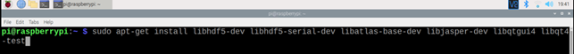

### 2. Instalación OpenCV 4 con sus módulos principales 

```Shell
pip3 install opencv-contrib-python==4.1.0.25
```

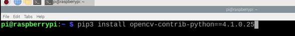

### 3. Comprobación de la instalación CV2  

```Shell
python3
```

```Shell
import cv2
```

```Shell
cv2.__version__
```

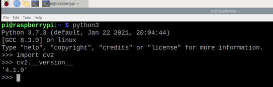

## __2. Instalación pickle__

```Shell
pip3 install pickle-mixin
```
## __3. Instalación libreria del cliente de Google__

```Shell
pip3 install --upgrade google-api-python-client google-auth-httplib2 google-auth-oauthlib
```


### Foto cámara implementada

### Foto contacto magnético en puerta
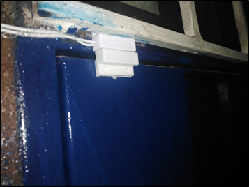

Una vez enviada la alerta al controlador Maestro, la SBC se encarga de establecer comunicación con la cámara IP, iniciar la grabación y posteriormente enviar el video por correo electrónico, por lo cual, es necesario realizar una serie de ajustes en la cámara para asignarle una IP estática.

# __Desarrollo Programa Python Para Grabación de Video Y Envio Correo Electronico__

## __Configuracion de la camara IP__
Para comunicar la cámara IP con la Raspberry PI 4 es necesario asignar una IP estática para la cámara en la red local. La aplicación V380 PRO proporcionada por el fabricante de la cámara, nos permite configurarla.

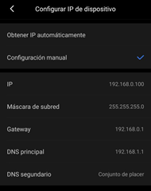

Esto es necesario ya que se requiere conocer la dirección URL de RTSP (Protocolo de transmisión en tiempo real) de la cámara IP, este URL lo podemos conocer ingresando la nueva IP estática de la cámara en el programa ONVIF.

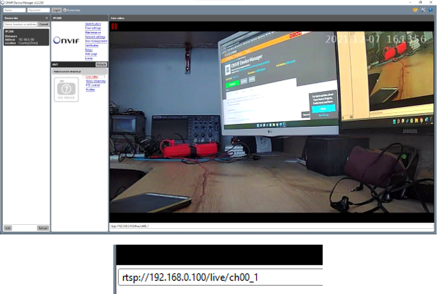

Una vez conocida la URL de RTSP, ya se puede configurar los parámetros necesarios para la captura de video.

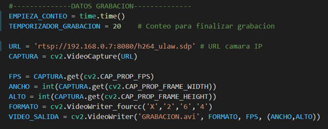

En este bloque de código se configuran los parámetros que tendrá el video: ancho de imagen (pixeles), alto de imagen (pixeles), y fotogramas por segundo. También se debe configurar el formato en el cual está codificado el video (X264) y finalmente, el nombre que recibirá la grabación al guardarse (GRABACION.avi) posteriormente este formato sera cambiado por .MP4 para que se peuda visualizar en cualquier dispositivo. 

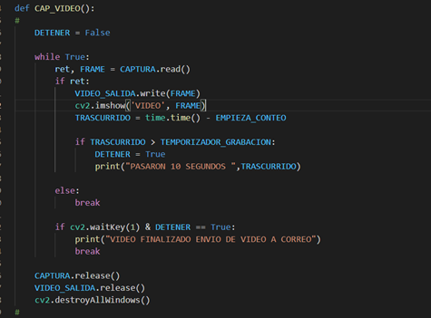

Una vez la SBC recibe la orden de grabar el video y este ha sido procesado se procede a enviar al correo electrónico del usuario mediante la API de Gmail y la autenticación OAuth 2.0 recomendada por Google, ya que el cliente de protocolo SMTP (Protocolo simple de transferencia de correo) comúnmente usada para el envió de correos electrónicos requiere acceso de aplicaciones poco seguras y esta opción pierde su acceso a partir del 30 de mayo de 2022. 

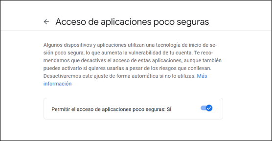

Durante el desarrollo del proyecto se usó Gmail como plataforma para enviar el video y los pasos serán descritos a continuación:

## __Configuracion API Gmail y envio de correo__ 

Para usar los servicios de API de Google Gmail se deben seguir una serie de pasos descritos a continuación estos pasos son suministrados por la documentación de Google [ (API DE GMAIL) ](https://developers.google.com/gmail/api/quickstart/python).

En primer lugar, se debe crear un proyecto en [Google Cloud Platform](https://console.cloud.google.com/), en la barra de búsqueda se debe buscar la API de Gmail, luego se debe crear un proyecto en API Y SERVICIOS donde se deberá crear también las credenciales (ID de cliente de OAuth)

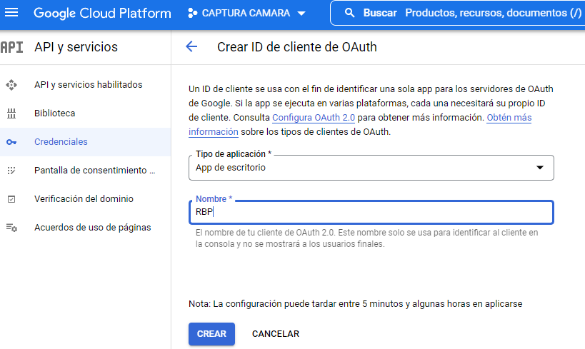

una vez habilitada la API podremos descargar las credenciales (.json), estas serán necesarias para obtener el token que permite la autenticación mediante OAuth 2.0.

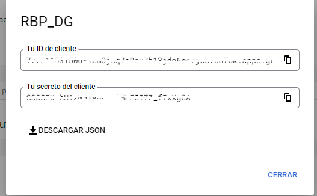

Este archivo debe estar en la misma ruta donde se encuenta el codigo (CAPTURA_CAMARA.py) con el nombre de CREDENCIALES

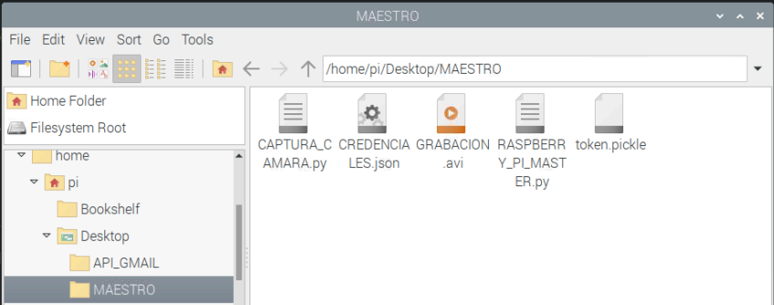

La primera vez que el código es ejecutado lo redirecciona a una ventana que le solicita iniciar sesión con su cuenta de Google y pedirá que autorice el acceso a sus datos  

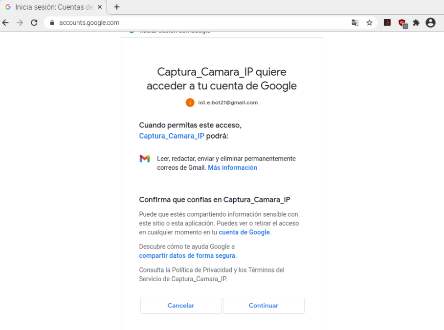

 Este correo será utilizado como remitente a la hora en enviar el video de la apertura de la puerta al usuario. 

Una vez finalizado el proceso de captura de video, el video será almacenado en una ruta especifica y enviado al correo electrónico, dicho video será sobrescrito con cada nueva alerta. 
### Correo electrónico enviado


## Hardware Módulo de Monitoreo de Puerta
### Diagrama esquemático etapa de alimentación
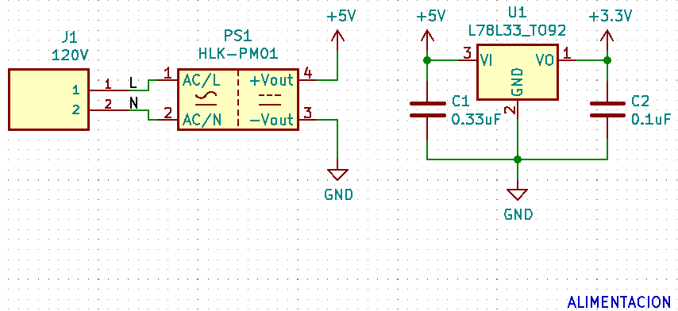

En la anterior figura se muestra la etapa de alimentación del módulo de control.
### Diagrama esquemático circuito contacto magnético y led indicador
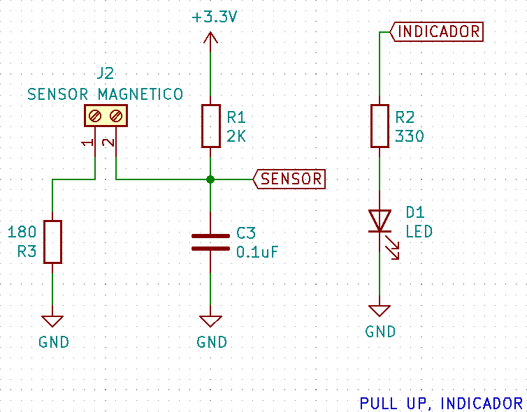

La anterior figura muestra un circuito resistivo tipo pull up con antirrebote, ya que el sensor magnético es en esencia un interruptor mecánico activado mediante un campo magnético (Reed switch). Al ser accionado con la apertura de la puerta cambia su estado, por lo cual el circuito antirrebote es indispensable para evitar falsos disparos en las interrupciones por flancos del microcontrolador. También se observa un led encargado de indicar el cambio de estado del sensor.

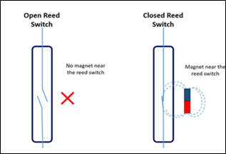
### Diagrama esquemático etapa de control
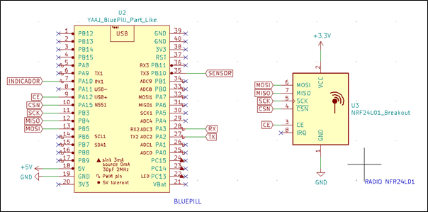

La figura muestra la etapa de control compuesta por el microcontrolador, encargado de monitorear el estado del sensor magnético, y el radio NFR24L01, encargado de comunicarse con el maestro enviándole una alerta indicando la apertura de la puerta, para que este inicie el proceso de captura y envió del video desde la cámara IP.

## Código Control Cámara Raspberry
```python
import os
import pickle
import cv2
import numpy as np
import time
# Utilidades de la API de Gmail
from googleapiclient.discovery import build
from google_auth_oauthlib.flow import InstalledAppFlow
from google.auth.transport.requests import Request
# codificar/decodificar mensajes en base64
from base64 import urlsafe_b64decode, urlsafe_b64encode
from email.encoders import encode_base64
# para tratar con tipos MIME adjuntos
from email.mime.text import MIMEText
from email.mime.multipart import MIMEMultipart
#from email.mime.image import MIMEImage
#from email.mime.audio import MIMEAudio
from email.mime.base import MIMEBase
from mimetypes import guess_type as guess_mime_type

#--------------DATOS GRABACION--------------
EMPIEZA_CONTEO = time.time()   # conteo para finalizar grabacion
TEMPORIZADOR_GRABACION = 20    # tiempo de ejecucion del programa

URL = 'rtsp://192.168.0.100/live/ch00_1' # URL camara IP
CAPTURA = cv2.VideoCapture(URL)

FPS = CAPTURA.get(cv2.CAP_PROP_FPS)
ANCHO = int(CAPTURA.get(cv2.CAP_PROP_FRAME_WIDTH))
ALTO = int(CAPTURA.get(cv2.CAP_PROP_FRAME_HEIGHT))
FORMATO = cv2.VideoWriter_fourcc('X','2','6','4')
VIDEO_SALIDA = cv2.VideoWriter('GRABACION.avi', FORMATO, FPS, (ANCHO,ALTO))

#-----------DATOS ENVIO CORREO------------------

SCOPES = ['https://mail.google.com/'] #Solicitud acceso: Lea, redacte, envíe y 
                                      #elimine permanentemente todo su correo electrónico de Gmail

RUTA_GRABACION = "/home/pi/Desktop/MAESTRO/GRABACION.avi" # Direccion donde se encuentra la 
                                                          # grabacion que se enviara por correo 

CORREO_MAESTRO = 'iot.e.bot21@gmail.com'
CORREO_DESTINO = "dgomezbernal24@gmail.com"
CORREO_DESTINO_2 = "cristiancobos2002@gmail.com"
ASUNTO_MSG = "ALERTA APERTURA PUERTA"
CUERPO_MSG = "GRABACION DE ALERTA DETECTADA EN LA PUERTA"

#-------------------------------------------------

def gmail_authenticate():
    creds = None
    # el archivo token.pickle almacena los tokens de acceso y actualización del usuario, y es
    # creado automáticamente cuando el flujo de autorización se completa por primera vez
    if os.path.exists("token.pickle"):
        with open("token.pickle", "rb") as token:
            creds = pickle.load(token)
    # si no hay credenciales disponibles, permita que el usuario inicie sesión.
    if not creds or not creds.valid:
        if creds and creds.expired and creds.refresh_token:
            creds.refresh(Request())
        else:
            flow = InstalledAppFlow.from_client_secrets_file('CREDENCIALES.json', SCOPES)
            creds = flow.run_local_server(port=0)
        # guardar las credenciales para la próxima ejecución
        with open("token.pickle", "wb") as token:
            pickle.dump(creds, token)
    return build('gmail', 'v1', credentials=creds)

# obtener el servicio API de Gmail
service = gmail_authenticate()

# Agrega el archivo adjunto con el nombre de archivo dado al mensaje dado
def add_attachment(message, filename):

    content_type, encoding = guess_mime_type(filename)

    if content_type is None or encoding is not None:
        content_type = 'application/octet-stream'
    main_type, sub_type = content_type.split('/', 1)

    fp = open(filename, 'rb')
    msg = MIMEBase(main_type, sub_type)

    msg.set_payload(fp.read())
    fp.close()
    encode_base64(msg)

    msg.add_header('Content-Disposition', 'attachment', filename ='VIDEO GRABADO.mp4' )
    message.attach(msg)

def build_message(CORREO_DESTINO, ASUNTO, body, attachments=[]):

    message = MIMEMultipart()

    message['to'] = CORREO_DESTINO
    message['from'] = CORREO_MAESTRO
    message['subject'] = ASUNTO

    message.attach(MIMEText(body))

    for filename in attachments:
        add_attachment(message, filename)

    return {'raw': urlsafe_b64encode(message.as_bytes()).decode()}

def ENVIO_CORREO(service, CORREO_DESTINO, ASUNTO, body, attachments=[]):
    return service.users().messages().send(
      userId="me",
      body=build_message(CORREO_DESTINO, ASUNTO, body, attachments)
    ).execute()

def CAP_VIDEO():
   
    DETENER = False
    EMPIEZA_CONTEO = 0.0
    EMPIEZA_CONTEO = time.time() 
    
    while True:
              
        ret, FRAME = CAPTURA.read()
        
        if (ret == 1):         
            print("GRABANDO")       
            print("FPS = "   + str(FPS))
            print("ANCHO = " + str(ANCHO))
            print("ALTO = "  + str(ALTO))            
        
            VIDEO_SALIDA.write(FRAME)
            cv2.imshow('VIDEO', FRAME)               
            TRASCURRIDO = time.time() - EMPIEZA_CONTEO
            
            if TRASCURRIDO > TEMPORIZADOR_GRABACION:
                DETENER = True
                print("PASARON " + str(TRASCURRIDO) + " SEGUNDOS")
                
        else:
            break
        
        if (cv2.waitKey(1) & DETENER == True):
            
            print("CAPTURA DE VIDEO FINALIZADO ")
            DETENER = False
            EMPIEZA_CONTEO = 0.0
            EMPIEZA_CONTEO = time.time()
            ret = True
            TRASCURRIDO = 0.0                  
            break
    
    CAPTURA.release()
    VIDEO_SALIDA.release()
    cv2.destroyAllWindows()    

if __name__ == '__main__':

    CAP_VIDEO()
    print("SE CERRO PROGRAMA DE GRABACION EMPEZANDO ENVIO DE CORREO ") 
    ENVIO_CORREO(service, CORREO_DESTINO, ASUNTO_MSG, CUERPO_MSG, [RUTA_GRABACION])
    ENVIO_CORREO(service, CORREO_DESTINO_2, ASUNTO_MSG, CUERPO_MSG, [RUTA_GRABACION])
    exit(1)
```

## Diagrama de Flujo Código en Python Para Captura y Envío de Video (SBC)

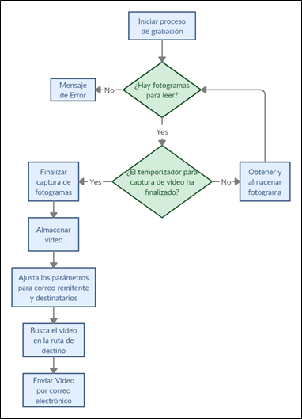

## Código Módulo de Monitoreo de Puerta en C (Microcontrolador)
```c
//CODIGO ESCLACO CONTROL PUERTA Y CAMARA
//EN RADIOS nRF24L01                                                         

#include "mbed.h"
#include "nRF24L01P.h"

#define RETARDO       2000

#define MI_FREQ_MST 2400
#define DIR_MAESTRO 0x000002   //DIRECCION DE RECEPCION DEL MAESTRO

#define RF_CAMARA   2480
#define DIR_CAMARA  0x00000D
#define POTENCIA_T  0
#define VEL_T       250
#define TAMANO_DIR  3
#define TAMANO      4

#define INTEN       20

Serial PC(PA_2,PA_3);//TX,RX

nRF24L01P RADIO(PB_5, PB_4, PB_3, PA_15, PA_12);    // MOSI, MISO, SCK, CSN, CE, IRQ----IRQ NO ESTA DEFINIDO NI CONECTADO, LA RECOMENDACION VIENE DADA POR LA LIBRERIA USADA

//DigitalOut      ON(PC_13);
DigitalIn       SENSOR_PUERTA (PB_10); //(PULL UP) |PIN EN ALTO: PUERTA ABIERTA, PIN EN BAJO PUERTA CERRADA  
DigitalOut      INDICADOR (PA_10);     //INDICADOR LED PUERTA ABIERTA -- POSIBLE INDICADOR CUANDO CORREO SEA ENVIADO O GRABACION TOMADA 

void CONF_GENER (int FRECUENCIA, int POTENCIA, int VELOCIDAD, unsigned long long DIRECCION_RX, int TAMAÑO_D, int TUBERIA);
void CONF_RADIO (unsigned long long DIRECCION_TX, int TAM_INFO);
void RECIBIR (void);
void PREPARAR (int ANCHO, unsigned long long DIRECCION, int TAM_DIR, int RF);
void ENVIAR_A(void);

char RX_DATA [TAMANO];
char TX_DATA [TAMANO];

//-------VARiABLES PARA LA CAMARA---------
char ALERTA  = 0;
char PERMISO = 0; 
char CONT = 0; 
char RESP = 0;

int main ()
{   
    //ON = 0;
    RADIO.powerUp();                                                                             //Radio ENCENDIDO y en modo STANDBY
    CONF_GENER (RF_CAMARA, POTENCIA_T, VEL_T, DIR_CAMARA, TAMANO_DIR, NRF24L01P_PIPE_P0);                     //CONFIGURACION INICIAL radio
    CONF_RADIO (DIR_MAESTRO, TAMANO); 
    PC.printf("******CONF_INICIAL*******\r\n");                              //DIRECCION INICIAL de Transmision
    PC.printf( "nRF24L01+ Frequency    : %d MHz\r\n",  RADIO.getRfFrequency() );
    PC.printf( "nRF24L01+ Output power : %d dBm\r\n",  RADIO.getRfOutputPower() );
    PC.printf( "nRF24L01+ Data Rate    : %d kbps\r\n", RADIO.getAirDataRate() );
    PC.printf( "nRF24L01+ TX Address   : 0x%010llX\r\n", RADIO.getTxAddress() );
    PC.printf( "nRF24L01+ RX Address   : 0x%010llX\r\n", RADIO.getRxAddress() );
    PC.printf("*****************\r\n");
    //RADIO.setReceiveMode(); //Modo de RECEPCION ACTIVADO
    RADIO.setTransmitMode();    // MANDA TODO EL TIEMPO EL ESTADO 
    RADIO.enable();
    
    INDICADOR = 0; 
    
    while (1)
    {             
        while(SENSOR_PUERTA == 1)
        {
            PC.printf("PUERTA ABIERTA \r\n");  
            INDICADOR = 1; 
            wait_ms (1000);  
            ALERTA = 1;
            if(ALERTA == 1 && PERMISO == 0)
            {
                PC.printf("ENTRO AL IF DE ALERTA \r\n");
                for (int i = 0; i<4;i++)        // LIMPIA POR SI QUEDO DE LA ANTERIOR ALERTA 
                {
                    TX_DATA[i] = ' ';
                }  
                ENVIAR_A();                     //ENVIA                  
            }                       
        }
        while(SENSOR_PUERTA == 0)
        {
            PC.printf("PUERTA CERRADA\r\n");  
            INDICADOR = 0;  
            wait_ms (1000);      
            PERMISO = 0;  
            RESP = 0; 
            CONT = 0;           
        }
    }                                                                        
}

void CONF_GENER (int FRECUENCIA, int POTENCIA, int VELOCIDAD, unsigned long long DIRECCION_RX, int TAMAÑO_D, int TUBERIA)
{
    RADIO.setRfFrequency(FRECUENCIA);                        //FRECUENCIA de TRANSMISION en MHz  (2400-2525)
    RADIO.setRfOutputPower(POTENCIA);                        //POTENCIA DE SALIDA EN dBm
    RADIO.setAirDataRate(VELOCIDAD);                         //Velocidad de TRASNFERENCIA de Datos en KBTS/S
    RADIO.setRxAddress(DIRECCION_RX, TAMAÑO_D, TUBERIA);     //Configuracion de DIRECCION de RECEPCION (DIRECCION, TAMAÑO de la DIRECCION en bytes, TUBERIA 0-5) LAS TUBERIAS 0 Y 1 admiten tamaños de 3,4,5 bytes. Las Demas por defecto solo tienen un byte de tamaño para la direccion
}
void CONF_RADIO (unsigned long long DIRECCION_TX, int TAM_INFO)
{
    RADIO.setTxAddress(DIRECCION_TX, TAMANO_DIR);            //Configuracion de DIRECCION de TRANSMISION (DIRECCION, TAMAÑO de la DIRECCION en bytes) LA TUBERIA va directamente LIGADA a la configurada en la RECEPCION
    RADIO.setTransferSize(TAM_INFO);                         //ESTABLECER el TAMAÑO en BYTES de la TRANSFERENCIA 
}    
void RECIBIR (void)
{
    int rxDataCnt = 0;   
    RADIO.read(NRF24L01P_PIPE_P0, RX_DATA, TAMANO);
    for(int i = 0; i<=TAMANO; i++)
    {
        PC.printf("%c",RX_DATA[i]);       
    }
    PC.printf("\r\n");
}
void PREPARAR (int ANCHO, unsigned long long DIRECCION, int TAM_DIR, int RF)
{
    RADIO.setTransferSize (ANCHO);
    RADIO.setTxAddress (DIRECCION,TAM_DIR);
    RADIO.setRfFrequency (RF);
}

void ENVIAR_A(void)
{
    TX_DATA [0] = 'S';          //ENVIA ALERTA QUE SE ABRIO LA PUERTA AL MAESTRO 
    TX_DATA [1] = 'P';
    TX_DATA [2] = 'A';
    TX_DATA [3] = 'D';
     
    while(RESP == 0)
    {
        RADIO.setTransmitMode();
        RADIO.setRfFrequency(MI_FREQ_MST);
        RADIO.write(NRF24L01P_PIPE_P0, TX_DATA, TAMANO);
        PC.printf("RADIO ENVIO MENSAJE \r\n");
        RADIO.setRfFrequency (RF_CAMARA);
        RADIO.setReceiveMode();
        wait_ms (RETARDO);  
        
        CONT = CONT + 1;  
        if(CONT == INTEN)
        {
            PERMISO = 1;
            RESP = 1;           
            PC.printf("CONTADOR = %d\r\n",CONT);  
        }  
                            
        if(RADIO.readable())
        {
            PC.printf("RADIO TIENE ALGO PARA LEER \r\n"); 
            RECIBIR();
            if(RX_DATA[0] == 'S' && RX_DATA[1] == 'G' && RX_DATA[2] == 'Y' && RX_DATA[3] == 'E') //confirma la recepcion de datos 
            {
                PC.printf("SE CONFIRMO LA ALERTA, INICIO GRABACION Y EL ENVIO \r\n");
                RESP = 1;
                ALERTA = 0;
                PERMISO = 1;  
                CONT = INTEN;
                                      
                RADIO.setTransmitMode();
                RADIO.setRfFrequency(MI_FREQ_MST);
            }               
        }           
    }   
}
```
## Diagrama de Flujo Código en C Para Microcontrolador
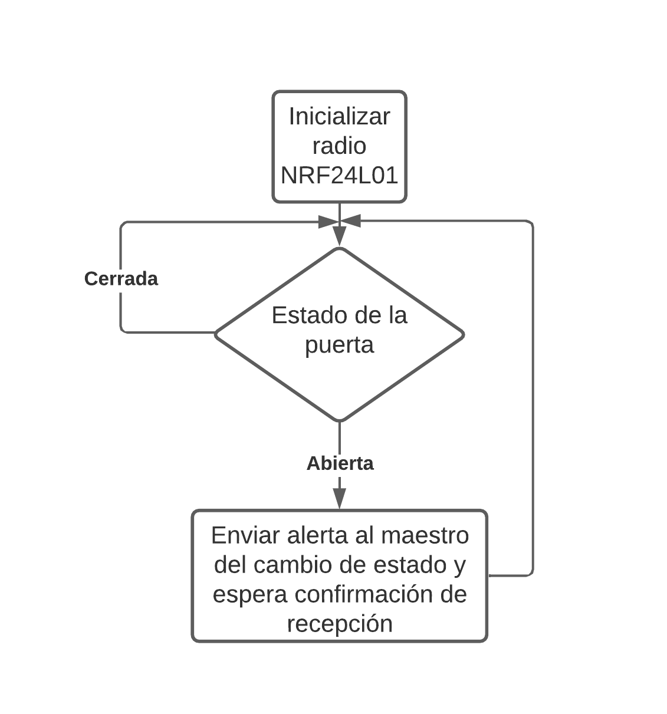
