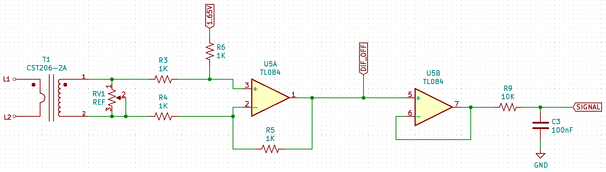
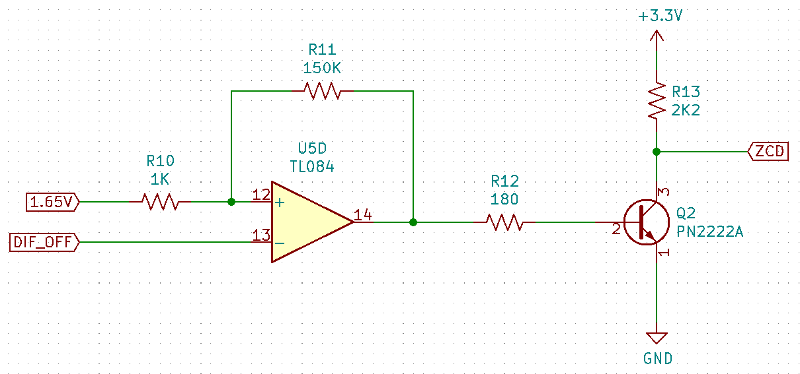
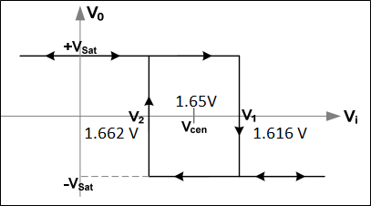
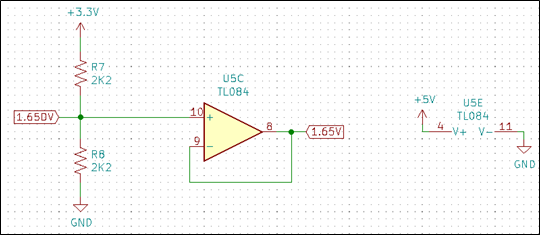
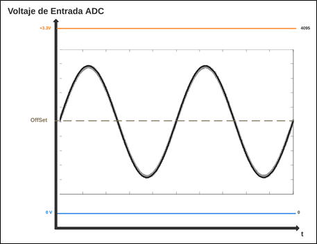
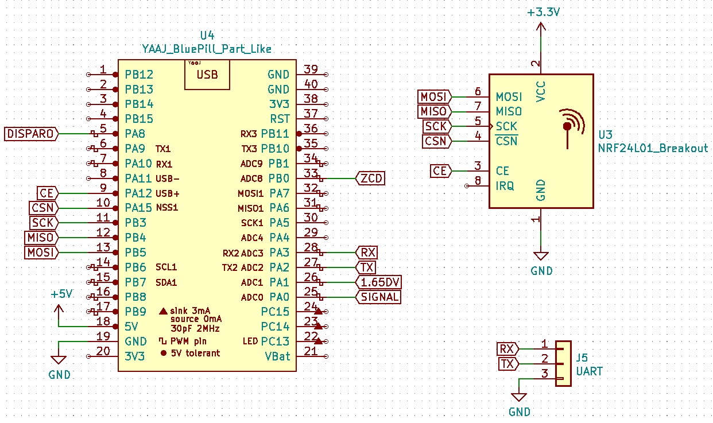
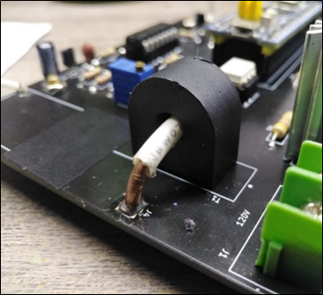
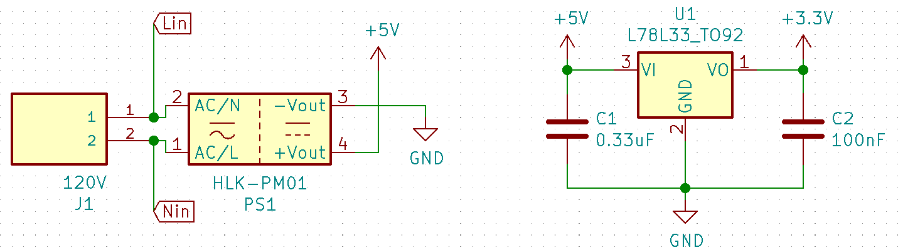
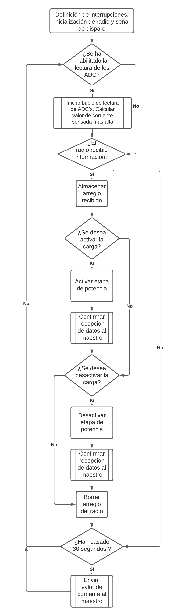

# Diseño Módulo Sensor de Corriente


El funcionamiento del sensor de corriente no invasivo (HMCT103C) consiste un transformador de corriente con una relación 1000:1, lo que equivale a obtener 1mA en los terminales de salida del transformador por cada Amperio consumido por la carga.


Para poder sensar la corriente entregada a la carga, es necesario conectar en paralelo una resistencia de Shunt al transformador de corriente, cuya función es entregar una caída de tención que es directamente proporcional a la corriente inducida en el bobinado del sensor.



En la figura se puede observar el circuito para el tratamiento de la señal captada por el sensor de corriente. La resistencia de Shunt seleccionada fue un potenciómetro lineal (RV1), ya que facilita el ajuste de la señal para efectos de cálculo en el microcontrolador.

La caída de tensión en la resistencia variable ingresa a un amplificador diferencial cuya función es rechazar las señales en modo común provenientes de la red eléctrica y evitar que pasen al sistema; a su vez en esta etapa se adiciona un voltaje de offset de 1.65V. Posteriormente la señal pasa por un amplificador seguidor que a la salida incluye un filtro pasa bajos RC con frecuencia de corte en 159 Hz.


La señal de salida (SIGNAL) es ingresada al ADC del microcontrolador y representa la corriente sensada por el sistema.



La figura anterior muestra un circuito detector de cruce por cero idéntico al utilizado en el módulo dimmer, pues cada vez que exista un consumo de corriente, este circuito genera una señal cuadrada que es la referencia utilizada por el microcontrolador para saber en qué momento 	iniciar la lectura de los puertos analógicos y realizar los cálculos respectivos de la corriente RMS.






Es importante mencionar que en este circuito es necesario una referencia de voltaje estable, pues a diferencia del dimmer, la señal AC (correspondiente a la corriente entregada a una carga resistiva) es ingresada al ADC del microcontrolador, y para que los cálculos realizados por el microcontrolador concuerden con la lectura real, se requiere de que el nivel DC sumado a la señal sea estable en el tiempo, además que permite garantizar que a medida que la corriente se incrementa (la amplitud de la señal crece), los límites de lectura para el semiciclo positivo y negativo sean los mismos (recordemos que el voltaje de lectura del ADC se encuentre entre 0 y 3.3V). 



Como se observa, las entradas analógicas del microcontrolador incorporado en la Blue Pill tiene una ventana de medición entre 3.3V como valor máximo (voltaje de alimentación) y 0V. Cualquier voltaje fuera de esta ventana no puede ser leído por el ADC e incluso puede causar daños en el mismo.



La etapa de control está compuesta por el microcontrolador, quien realiza el cálculo de la corriente RMS, y el radio de comunicación se encarga de enviar la corriente sensada al maestro y recibir las ordenes de activación o desactivación de la etapa de potencia.


El microcontrolador realiza el cálculo del valor RMS de corriente a partir de la lectura de las señales del ADC. este valor es actualizado en el dashboard y dependiendo de la acción establecida por el usuario se activa o desactiva la carga mediante un optoacoplador y un TRIAC.


La etapa de potencia para este módulo tiene como objeto habilitar o deshabilitar la conexión a la carga de corriente alterna mediante la señal DISPARO, por lo cual, no se incluye ninguna red Snubber para falsos disparos en el gate del TRIAC, 	además, recordemos que se pretende sensar únicamente corrientes entregadas a cargas resistivas, por lo que tampoco se incluye la red Snubber para cargas inductivas.

Los terminales J3 y J4 representan perforaciones realizadas a la PCB, cuyo objeto es soldar un cable entre ellos que será el que atravesará el sensor de corriente.





La figura anterior muestra la etapa de alimentación del sistema.

El software desarrollado para este módulo cuenta con un circuito detector de cruce por cero con el cual se pretende realizar la lectura del ADC únicamente durante el semiciclo positivo de la señal, y almacenar el valor más alto censado en el mismo (valor pico).


## Bloque de Código para Lectura de ADC's y Cálculo de Corriente RMS
```c
while(CALCULAR == 1)
{
    LEC_P   = SENSOR.read();
    //LEC_DC  = VOL_DC.read();
    LEC_SCP = LEC_P * 3.3;
    //LEC_VDC = LEC_DC * 3.3;
    LEC_VDC = 1.65;
    DIFERENCIA = LEC_SCP - LEC_VDC;
    COR_PICO = DIFERENCIA / 0.075;
    COR_RMS_TEMP = COR_PICO * 0.707;
    
    if(COR_RMS < COR_RMS_TEMP)
    {
        COR_RMS = COR_RMS_TEMP;
        //PC.printf(" La diferencia es : %f   \r\n",DIFERENCIA);
        //PC.printf(" La COR_PICO es : %f Ap  \r\n",COR_PICO);
        //PC.printf(" La COR_RMS  es : %f Arms\r\n",COR_RMS);
    }
}
```
Al detectar el flanco de subida que concuerda con el cruce por cero previo al inicio del semiciclo positivo de la señal, se habilita la secuencia de cálculos para interpretar la señal AC del sensor de corriente. En la figura 55 se observa que la señal AC montada sobre un nivel DC ingresa a una entrada analógica, la lectura realizada en el ADC es multiplicada por 3.3V para obtener su equivalente en voltaje y finalmente se le resta 1.65V, que corresponde al offset de la señal. Así entonces almacenamos en COR_PICO el valor máximo AC de la señal.

El valor pico de la señal es dividida entre 75mV (cada 75mVp equivalen a 1 Ap entregado a la carga), este valor debe ser multiplicado por 0.707 para obtener el valor eficaz de la corriente entregada a la carga. 

Obsérvese que el valor de la corriente RMS solo es actualizado cada vez que se toma una lectura pico mayor que la anterior.

```c
//CODIGO ESCLAVO SENSOR DE CORRIENTE ON/OFF
//EN RADIOS nRF24L01                                                         

#include "mbed.h"
#include "nRF24L01P.h"

#define RETARDO       2000
#define REPETIR_ENVIO 20

#define MI_FREQ_MST 2400
#define DIR_MAESTRO 0x000002   //DIRECCION DE RECEPCION DEL MAESTRO

#define RF_TOMA 2440
#define DIR_TOMA 0x00000B
#define POTENCIA_T      0
#define VEL_T           250
#define TAMANO_DIR      3
  
#define TAMANO          4

#define T_STOP 8333

Serial PC(PA_2,PA_3);//TX,RX

nRF24L01P RADIO(PB_5, PB_4, PB_3, PA_15, PA_12);    // MOSI, MISO, SCK, CSN, CE, IRQ----IRQ NO ESTA DEFINIDO NI CONECTADO, LA RECOMENDACION VIENE DADA POR LA LIBRERIA USADA

AnalogIn SENSOR (PA_0);
AnalogIn VOL_DC (PA_1);

InterruptIn F_SUBIDA(PB_0);
DigitalOut CONTROL(PA_8);
Timeout TM_OUT;
Timer timer;

void CONF_GENER (int FRECUENCIA, int POTENCIA, int VELOCIDAD, unsigned long long DIRECCION_RX, int TAMAÑO_D, int TUBERIA);
void CONF_RADIO (unsigned long long DIRECCION_TX, int TAM_INFO);
void RECIBIR (void);
void PREPARAR (int ANCHO, unsigned long long DIRECCION, int TAM_DIR, int RF);
void FLANCOS (void);
void LECTURAS (void);
void ENVIARC (void);
void ENVIAR_ESTADO_I (void);
void LEER_RADIO (void);

char RX_DATA [TAMANO];
char TX_DATA [TAMANO];
char ESTADO_INICIAL [TAMANO] = {'T','I','O','F'};
char CONFIRMAR [TAMANO] = {'T','M','O','N'};
char CONFIRMAR_2 [TAMANO] = {'T','M','O','F'};

int INTENTOS = 0;
int INTENTOS_I = 0;

char RESP = 0;  
char RESP_I = 0;

unsigned char CALCULAR = 0;

//unsigned int T_LEC = 4166;

float TIEMPO = 0.0;

float LEC_P = 0.0;
float LEC_DC = 0.0;

float LEC_SCP = 0.0;
float LEC_VDC = 0.0;

float DIFERENCIA = 0.0;

float COR_PICO = 0.0;
float COR_RMS = 0.0;

float COR_RMS_TEMP = 0.0;

int DECIMAL  = 0;
int UNIDAD_1 = 0;
int UNIDAD_2 = 0;

int main ()
{
    CONTROL = 1;
    RADIO.powerUp();                                                                             //Radio ENCENDIDO y en modo STANDBY
    CONF_GENER (RF_TOMA, POTENCIA_T, VEL_T, DIR_TOMA, TAMANO_DIR, NRF24L01P_PIPE_P0);                     //CONFIGURACION INICIAL radio
    CONF_RADIO (DIR_MAESTRO, TAMANO); 
    PC.printf("********************CONF_INICIAL********************\r\n");                              //DIRECCION INICIAL de Transmision
    PC.printf( "nRF24L01+ Frequency    : %d MHz\r\n",  RADIO.getRfFrequency() );
    PC.printf( "nRF24L01+ Output power : %d dBm\r\n",  RADIO.getRfOutputPower() );
    PC.printf( "nRF24L01+ Data Rate    : %d kbps\r\n", RADIO.getAirDataRate() );
    PC.printf( "nRF24L01+ TX Address   : 0x%010llX\r\n", RADIO.getTxAddress() );
    PC.printf( "nRF24L01+ RX Address   : 0x%010llX\r\n", RADIO.getRxAddress() );
    PC.printf("****************************************************\r\n");
    RADIO.setReceiveMode(); //Modo de RECEPCION ACTIVADO
    RADIO.enable();
    
    timer.start();
    
    F_SUBIDA.rise(&FLANCOS);

    ENVIAR_ESTADO_I ();
    
    while (1)
    {
        while(CALCULAR == 1)
        {
            LEC_P   = SENSOR.read();
            //LEC_DC  = VOL_DC.read();
            LEC_SCP = LEC_P * 3.3;
            //LEC_VDC = LEC_DC * 3.3;
            LEC_VDC = 1.65;
            DIFERENCIA = LEC_SCP - LEC_VDC;
            COR_PICO = DIFERENCIA / 0.075;
            COR_RMS_TEMP = COR_PICO * 0.707;
            
            if(COR_RMS < COR_RMS_TEMP)
            {
                COR_RMS = COR_RMS_TEMP;
                //PC.printf(" La diferencia es : %f   \r\n",DIFERENCIA);
                //PC.printf(" La COR_PICO es : %f Ap  \r\n",COR_PICO);
                //PC.printf(" La COR_RMS  es : %f Arms\r\n",COR_RMS);
            }
        }
        
        PC.printf(" La COR_RMS  es : %f Arms\r\n",COR_RMS);
        
        
        if(RADIO.readable())
        {
            LEER_RADIO();           
        }
        
        TIEMPO = timer.read();
        if(TIEMPO >= 30.0)
        {
            ENVIARC();
        }
        
        //CADA VEZ QUE SE ENVÍE y SE CONFIRME LA RECEPCION DE LA CORRIENTE POR PARTE DEL AMESTRO SE DEBE BORRAR EL VALOR DE COR_TEMP Y COR_RMS, PARA EVITAR
        //QUE AL CONECTAR UNA CARGA DIFERENTES EL SISTEMA SIGA ALMACENANDO LA CORRIENTE DE LA CARGA ANTERIOR
    }   
}

void CONF_GENER (int FRECUENCIA, int POTENCIA, int VELOCIDAD, unsigned long long DIRECCION_RX, int TAMAÑO_D, int TUBERIA)
{
    RADIO.setRfFrequency(FRECUENCIA);                        //FRECUENCIA de TRANSMISION en MHz  (2400-2525)
    RADIO.setRfOutputPower(POTENCIA);                        //POTENCIA DE SALIDA EN dBm
    RADIO.setAirDataRate(VELOCIDAD);                         //Velocidad de TRASNFERENCIA de Datos en KBTS/S
    RADIO.setRxAddress(DIRECCION_RX, TAMAÑO_D, TUBERIA);     //Configuracion de DIRECCION de RECEPCION (DIRECCION, TAMAÑO de la DIRECCION en bytes, TUBERIA 0-5) LAS TUBERIAS 0 Y 1 admiten tamaños de 3,4,5 bytes. Las Demas por defecto solo tienen un byte de tamaño para la direccion
}
void CONF_RADIO (unsigned long long DIRECCION_TX, int TAM_INFO)
{
    RADIO.setTxAddress(DIRECCION_TX, TAMANO_DIR);              //Configuracion de DIRECCION de TRANSMISION (DIRECCION, TAMAÑO de la DIRECCION en bytes) LA TUBERIA va directamente LIGADA a la configurada en la RECEPCION
    RADIO.setTransferSize(TAM_INFO);                           //ESTABLECER el TAMAÑO en BYTES de la TRANSFERENCIA 
}    
void RECIBIR (void)
{
    int rxDataCnt = 0;
    
    RADIO.read(NRF24L01P_PIPE_P0, RX_DATA, TAMANO);
    for(int i = 0; i<=TAMANO; i++)
    {
        PC.printf("%c",RX_DATA[i]);
    }
    PC.printf("\r\n");
}
void PREPARAR (int ANCHO, unsigned long long DIRECCION, int TAM_DIR, int RF)
{
    RADIO.setTransferSize (ANCHO);
    RADIO.setTxAddress (DIRECCION,TAM_DIR);
    RADIO.setRfFrequency (RF);
}
void FLANCOS (void)
{
        TM_OUT.attach_us(&LECTURAS,T_STOP); 
        CALCULAR = 1;
}
void LECTURAS (void)
{
    CALCULAR = 0;
}
void ENVIARC (void)
{
    
    DECIMAL  = (COR_RMS - int(COR_RMS))*100;     
    UNIDAD_1 = (DECIMAL / 10);
    UNIDAD_2 = (DECIMAL % 10);
    
    TX_DATA [0] = int(COR_RMS) + 48;         
    TX_DATA [1] = UNIDAD_1 + 48;
    TX_DATA [2] = UNIDAD_2 + 48;
    TX_DATA [3] = 'Z';
    
    //
    RESP = 0;
    while(RESP == 0)
    {
        RADIO.setTransmitMode();
        RADIO.setRfFrequency(MI_FREQ_MST);
        RADIO.write(NRF24L01P_PIPE_P0, TX_DATA, TAMANO);
        PC.printf("RADIO ENVIO MENSAJE \r\n");
        RADIO.setRfFrequency (RF_TOMA);
        RADIO.setReceiveMode();
        wait_ms (RETARDO);
        if(RADIO.readable())
        {
            PC.printf("RADIO TIENE ALGO PARA LEER \r\n");
            RECIBIR();
            if(RX_DATA[0] == 'A' && RX_DATA[1] == 'M' && RX_DATA[2] == 'P' && RX_DATA[3] == 'R')
            {
                RESP = 1;
                INTENTOS = 0;
                RADIO.setRfFrequency (RF_TOMA);
                RADIO.setReceiveMode();
                COR_RMS = COR_RMS_TEMP = 0.0;
                timer.reset();
            }
        }
        
        INTENTOS = INTENTOS + 1;
        
        if (INTENTOS >= REPETIR_ENVIO)
        {
            RESP = 1;
            RADIO.setRfFrequency (RF_TOMA);
            RADIO.setReceiveMode();
            COR_RMS = COR_RMS_TEMP = 0.0;
            timer.reset();
            INTENTOS = 0;
        }
        LEER_RADIO();
    }
}

void ENVIAR_ESTADO_I (void)
{
    RESP_I = 0;

    while(RESP_I == 0)
    {
        RADIO.setTransmitMode();
        RADIO.setRfFrequency(MI_FREQ_MST);
        RADIO.write(NRF24L01P_PIPE_P0, ESTADO_INICIAL, TAMANO);
        PC.printf("RADIO ENVIO MENSAJE INICIAL \r\n");
        RADIO.setRfFrequency (RF_TOMA);
        RADIO.setReceiveMode();
        wait_ms (RETARDO);
        if(RADIO.readable())
        {
            PC.printf("RADIO TIENE ALGO PARA LEER \r\n");
            RECIBIR();
            if(RX_DATA[0] == 'T' && RX_DATA[1] == 'E' && RX_DATA[2] == 'I' && RX_DATA[3] == 'R')
            {
                RESP_I = 1;
                INTENTOS_I = 0;
                RADIO.setRfFrequency (RF_TOMA);
                RADIO.setReceiveMode();
            }
        }
        
        INTENTOS_I = INTENTOS_I + 1;
        
        if (INTENTOS_I >= REPETIR_ENVIO)
        {
            RESP_I = 1;
            RADIO.setRfFrequency (RF_TOMA);
            RADIO.setReceiveMode();
        }
        LEER_RADIO();
    }
}
void LEER_RADIO (void)
{
    PC.printf("ALGO LLEGO\r\n");
    RECIBIR();     
    if(RX_DATA [0] == 'L' && RX_DATA [1] == 'D' && RX_DATA [2] == 'O' && RX_DATA [3] == 'N')
    {
        CONTROL = 1;
        COR_RMS = COR_RMS_TEMP = 0.0;
        RADIO.setTransmitMode();
        char RESPUESTA = 0;
        while(RESPUESTA == 0)
        {
            PREPARAR (TAMANO, DIR_MAESTRO, TAMANO_DIR, MI_FREQ_MST);
            wait_ms(250);
            RADIO.write(NRF24L01P_PIPE_P0, CONFIRMAR, TAMANO);
            RESPUESTA = RESPUESTA + 1;
            for(int i = 0; i<TAMANO; i++)
            {
                PC.printf("%c",CONFIRMAR [i]);
            }
            PC.printf("\r\n");
        }
        RESPUESTA = 0;
        RADIO.setRfFrequency(RF_TOMA);
        RADIO.setReceiveMode();
    }
    if(RX_DATA [0] == 'L' && RX_DATA [1] == 'D' && RX_DATA [2] == 'O' && RX_DATA [3] == 'F')
    {
        CONTROL = 0;
        COR_RMS = COR_RMS_TEMP = 0.0;
        RADIO.setTransmitMode();
        char RESPUESTA = 0;
        while(RESPUESTA == 0)
        {
            PREPARAR (TAMANO, DIR_MAESTRO, TAMANO_DIR, MI_FREQ_MST);
            wait_ms(250);
            RADIO.write(NRF24L01P_PIPE_P0, CONFIRMAR_2, TAMANO);
            RESPUESTA = RESPUESTA + 1;
            for(int i = 0; i<TAMANO; i++)
            {
                PC.printf("%c",CONFIRMAR [i]);
            }
            PC.printf("\r\n");
        }
        RESPUESTA = 0;
        RADIO.setRfFrequency(RF_TOMA);
        RADIO.setReceiveMode();
    }
    for (int i = 0; i<4;i++)
    {
        RX_DATA[i] = ' ';
    }
}
```
## Diagrama de Flujo General Módulo Sensor de Corriente



